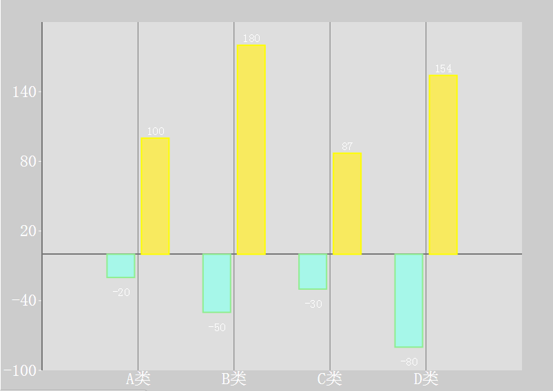

# 柱状图

图表构成都是由多个控件共同构成，如下：
- title：标题，   
- legend： 图例，  
- toolbox：工具箱，  
- tooltip:图例，  
- xAxis:x轴，  
- yaxis：y轴，  
- series：图表数据，  
- grid：绘图区域  
### 详细参数配置
	series作为驱动图表生成数据内容的数组，数组中每一项为一个系列的选项及数据	
	    series: [
		    {
		        name: 'xxx', // 唯一标识  启用legend时，该值将被legend.data索引相关联
		        type: 'bar', //柱形图需要设置type为bar
				tooltip: 'xxx', //提示框样式，仅对当前系列有效，详见tooltip配置
		        data: [], //柱形图数据

				//柱形样式设定
				itemStyle: { 
					normal: { //默认样式
						color: 'xxx' //柱形填充颜色
						barBorderColor: 'xxx' //柱形边框颜色
						barBorderRadius: 'xxx' //柱形圆角
						barBorderWidth： 'xxx'  //柱形边框线宽
						label: {
							show: true/false  //标签显示策略
							position: 'xxx' //标签显示位置
						}
					},
					emphasis: { //强调样式 配置情况与normal相似
						...
					}
				}，
				barWidth: 'xxx' //柱条宽度
				barMaxWidth: 'xxx' //柱条最大宽度
				barMinHeight: 'xxx' //柱条最小高度
				barGap: 'xxx' //柱间距离
				barCategoryGap: 'xxx' //多个类目间柱形距离

				//多个类目的数据可能需要两种不同的坐标轴标识，可以设置一下属性，需要与xAxis和yAxis里的设置一致才能起效
				xAxisIndex: 'xxx' //此类目下的xAxis坐标轴的索引
				yAxisIndex： 'xxx' //此类目下的yAxis坐标轴的索引

		    }
	    ]

