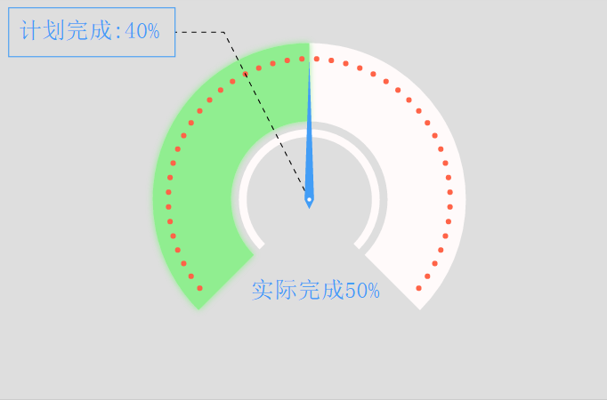

#gauge使用说明
此图用于百分比数据展示：

--------   
###相关参数说明：
	
	series配置如下：
	series: [
                {
                    name: 'Apple',
                    type: 'gauge',
                    coordinateSystem: 'cartesian2d',
                    data: [{
                        name: '实际完成',
                        value: '50%'
                    }, {
                        name: '计划完成',
                        value: '40%'
                    }],
                    radius: [80, 160], // 设置圆环的内外半径
                    startAngle: 1.25 * Math.PI, //
                    endAngle: 2.75 * Math.PI, //圆环最大角度，起始角度默认为12点方向，一个满圆为360度, 多个类目的数据时设置相同的endangle默认最大的value填充
                    itemStyle: { // 此处样式应用于气球连线，连线长度表示数值大小，其他的
                        finished: {
                            'fill': 'lightgreen'
                        },
                        unfinished: {
                            'fill': 'red'
                        },
                        outerRing: {
                            'fill': 'snow'
                            // 'stroke': 'red',
                            // 'stroke-width': 2
                        },
                        innerRing: {
                            'fill': 'snow'
                            // 'stroke': 'red',
                            // 'stroke-width': 2
                        },
                        tinyCircle: {
                            'fill': 'tomato'
                            // 'stroke': 'red',
                            // 'stroke-width': 2
                        },
                        pointerStyle: {
                            fill: '#429df6'
                        },
                        centerCircle: {
                            'fill': 'snow',
                            'r': 2
                        }
                    },
                    label: {

                        show: true,
                        width: 170,
                        height: 50,
                        textStyle: {
                            'font-size': '24px',
                            'font-famliy': '微软雅黑',
                            'fill': '#429df6'

                        },
                        rectStyle: {
                            'stroke': '#429df6',
                            'fill': 'transparent'
                        }
                    },
                    actualLabel: {
                        show: true,
                        x: -60,
                        y: 100,
                        textStyle: {
                            'font-size': '24px',
                            'font-famliy': '微软雅黑',
                            'fill': '#429df6'
                        }
                    }
               }

	 ]
	
####series相关参数说明：
#####type
	*参数类型： string
	*参数描述： 定义图表类型，使用Gauge图时需设置为'gauge'
#####data
	*参数类型： array
	*参数描述： 数组内包含两个对象，第一个是实际值，第二个是期望值，可以参考例子
#####radius
	*参数类型： array
	*参数描述： 设置圆环的内外半径
#####startAngle
	*参数类型： number
	*参数描述： 圆环的起始角度，与终止角度配合一起使用，可配置完整圆环和不完整圆环，此处为弧度值（num * Math.PI），默认12点方向为0
#####endAngle
	*参数类型： number
	*参数描述：圆环的终止角度，同起始角度一样，当终止角度与起始角度之差大于2 * Math.PI时，显示为圆环
#####itemStyle
	*参数类型: object
	*参数描述: 设置gauge图样式（包含7个配置参数）	
		#finished
			*参数类型： object
			*参数描述： 当data中的实际值大于期望值时采用的样式
		#unfinished
			*参数类型： object
			*参数描述： 当data中的实际值小于期望值时采用的样式
		#outerRing
			*参数类型： object
			*参数描述： 外测圆环的样式
		#innerRing
			*参数类型： object
			*参数描述： 内测圆环的样式
		#tinyCircle
			*参数类型： object
			*参数描述： 外侧圆环内部的小圆样式
		#pointerStyle
			*参数类型： object
			*参数描述： 指针样式 
		#centerCircle
			*参数类型： object
			*参数描述： 指针部分的圆形样式
#####label
	*参数类型：object
	*参数描述： 设置期望值的标签
		#show 
			*参数类型： boolean
			*参数描述： 是否显示标签
		#width
			*参数类型： number
			*参数描述： 标签宽度
		#height
			*参数类型： number
			*参数描述： 标签高度
		#textStyle
			*参数类型： object
			*参数描述： 标签文字样式
		#rectStyle
			*参数类型： object
			*参数描述： label容器样式
#####actualLabel
	*参数类型： object
	*参数描述： 设置实际值的标签
		#show 
			*参数类型： boolean
			*参数描述： 是否显示真是值的标签
		#x
			*参数类型： number
			*参数描述： label标签文字基于圆心的x方向偏移
		#y
			*参数类型： number
			*参数描述： label标签文字基于圆心的y方向偏移
		#textStyle
			*参数类型： object
			*参数描述： 标签文字样式