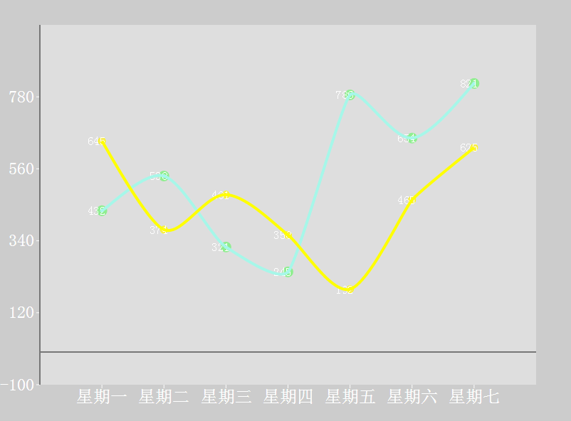

# 折线图

# 柱状图

图表构成都是由多个控件共同构成，如下：
- title：标题，   
- legend： 图例，  
- toolbox：工具箱，  
- tooltip:图例，  
- xAxis:x轴，  
- yaxis：y轴，  
- series：图表数据，  
- grid：绘图区域  
### 详细参数配置
	series作为驱动图表生成数据内容的数组，数组中每一项为一个系列的选项及数据
		
    series: [
	    {
	        name: 'xxx', // 唯一标识
	        type: 'line', //柱形图需要设置type为bar
	        data: [], //柱形图数据

			//折线样式设定
			itemStyle: { 
				normal: { //默认样式
					color: //折点颜色
					lineStyle: {
						color: 'xxx', //线条颜色
						type: 'xxx', //线条样式，可选为： 'solid'|'dotted'|'dashed' 
						width: 'xxx', //线宽
					}
				},
				emphasis: { //强调样式
					...
				}
			}，
			symbol： 'xxx' //折点样式 ，可选为：'circle'|'rectangle'|'triangle'|'diamond'|'emptyCircle'|'emptyRectangle'|'emptyTriangle'|'emptyDiamond' 
			symbolSize： 'xxx' //折点大小
			smooth: ture/false //平滑曲线

			//多个类目的数据可能需要两种不同的坐标轴标识，可以设置一下属性，需要与xAxis和yAxis里的设置一致才能起效
			xAxisIndex: 'xxx' //此类目下的xAxis坐标轴的索引
			yAxisIndex： 'xxx' //此类目下的yAxis坐标轴的索引
			
	    }
    ]

