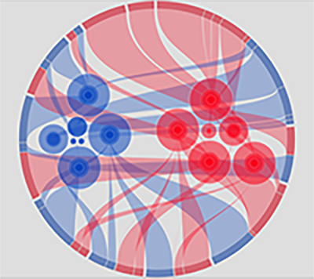

#packandArc使用说明
此图用于分类数据展示：
其中蓝色圆表示一组数据，红色表示另一组，每一组数据中又可以包含子类，连线代表与之关联的类别数据；
同时，也可以从圆环部分理解，每一个圆弧部分代表一组数据，每组数据也由子类组成，通过连线与圆代表的数据项关联.

--------   
###相关参数说明：
	
	series作为驱动图表生成数据内容的数组，数组中每一项为一个系列的选项及数据	
	    series: [
		    {
		        name: 'xxx', 
		        type: 'packandArc', 
				tooltip: 'xxx', 
		        data: [], 
				arcGap： 20， 
				itemStyle: {
					normal: {
					    'fill': ['rgb(248, 0, 24)', 'rgb(5, 67, 188)'], // 需要传入颜色数组
					    'stroke': 'rgb(255, 255, 255)',
					    'stroke-width': 5,
					    'fill-opacity': 0.5,
					    'stroke-opacity': 0.15
					
					},
					emphasis: {
					    'fill': ['rgba(248, 0, 240)', 'rgb(5, 67, 188)'],
					    'fill-opacity': 0.6,
					    'stroke': 'rgb(255, 255, 255)',
					    'stroke-width': 6.45248,
					    'stroke-opacity': 0.15
					}
				},
				linkStyle: {
				    normal: {
				        'fill': ['rgb(248, 0, 24)', 'rgb(5, 67, 188)'], // 需要传入颜色数组
				        // 'stroke': 'rgb(255, 255, 255)',
				        // 'stroke-width': 1,
				        'fill-opacity': 0.3
				        // 'stroke-opacity': 0.5
				
				    },
				    emphasis: {
				        'fill': ['rgba(248, 0, 24)', 'rgb(5, 67, 188)'],
				        'fill-opacity': '0.6',
				        'stroke': 'rgb(255, 255, 255)',
				        'stroke-width': 2,
				        'stroke-opacity': 0.05
				    }
				},
				// 圆弧部分样式
		        arcStyle: {
                    normal: {
                        'fill': ['rgb(248, 0, 24)', 'rgb(5, 67, 188)'] // 需要传入颜色数组
                    },
                    emphasis: {
                        'fill': ['rgba(248, 0, 24)', 'rgb(5, 67, 188)'],
                        'fill-opacity': '0.1',
                        'stroke': 'rgb(255, 255, 255)',
                        'stroke-width': 2,
                        'stroke-opacity': 0.05
                    }
                }

		    }
	    ]
	
####series相关参数说明：
#####type
	*参数类型： string
	*参数描述： 定义图表类型，使用Gauge图时需设置为'packandArc'

####data 
	*参数类型： array,
  	*参数描述： 可以由单个或者多个对象组成，每一个对象成员用一组圆表示，每个类目又包含子类，子类的来源是由弧度部分组成
	*参数解释：配置参数时需要按照下面的方式，对象的key值不能变。
	    data: [{
	        name: 'groupA', //类目1，图中蓝色的数据代表
	        value: 4130, 
	        children: [
	            {  // 子类1
	                name: 'a01', //子类名
	                value: 1000, // 数值
	                children: [ //二级子类
	                    {
	                        name: 'a01_01', //二级子类名
	                        value: 500,
	                        consist: 'arc1' //具体组成哪一段弧
	                    },
	                    {
	                        name: 'a01_02',
	                        value: 300,
	                        consist: 'arc12'
	                    },
	                    {
	                        name: 'a01_03',
	                        value: 100,
	                        consist: 'arc1'
	                    },
	                    {
	                        name: 'a01_04',
	                        value: 100,
	                        consist: 'arc2'
	                    }
	                ]
	            }
	        ]
	    },{
	        name: 'groupB',
	        value: 4180,
	        children: [
	            {
	                name: 'b01',
	                value: 1000,
	                children: [
	                    {
	                        name: 'b01_01',
	                        value: 500,
	                        consist: 'arc5'
	                    },
	                    {
	                        name: 'b01_1',
	                        value: 300,
	                        consist: 'arc12'
	                    },
	                    {
	                        name: 'b01_03',
	                        value: 100,
	                        consist: 'arc6'
	                    },
	                    {
	                        name: 'b01_04',
	                        value: 100,
	                        consist: 'arc7'
	                    }
	            }]
	   }]
   
#####arcGap
	*参数类型： number
	*参数描述： 圆环内外半径之差
#####itemStyle
	*参数类型： object
	*参数描述： 内部圆样式
		#fill
			*参数类型： array
			*参数描述： 根据data数组的个数设置相应的颜色数组个数，数组中的每个成员由一种颜色的圆环组成
#####linkStyle
	*参数类型： object
	*参数描述： 内部圆与外部弧连接部分样式
		#fill
			*参数类型： array
			*参数描述： 根据data数组二级子类个数生成的连接区域，一个方向连接内部圆，另一个方向连接外部弧，个数同itemStyle
#####arcStyle
	*参数类型： object
	*参数描述： 外部弧部分样式
		#fill
			*参数类型： array
			*参数描述： 根据data数组二级子类个数生成的弧度，由consist构成，个数同itemStyle

