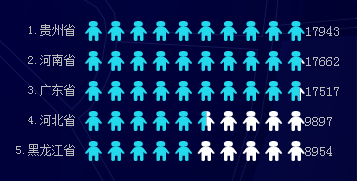

#tickbar使用说明

tickbar的实现是在bar图上添加蒙板，即为柱形图添加clipPath属性，实现想要的遮罩层图案，下图是遮罩层图案为小人时的显示效果：

--------   
###相关参数说明：
	
	series作为驱动图表生成数据内容的数组，数组中每一项为一个系列的选项及数据	
	    series: [
		    {
		        name: 'xxx', // 唯一标识  启用legend时，该值将被legend.data索引相关联
		        type: 'tickbar', //蒙板图需要设置type为tickbar
				tooltip: 'xxx', //提示框样式，仅对当前系列有效，详见tooltip配置
		        data: [], //蒙板图数据
				
				 //clipPath控制蒙版的显示的行为
			     clipPath: {
			 	     symbol: 'rect', //蒙板形状，可选为： 'rect' | 'circle' | 'person'
			     	 symbolGap: 0.3, //蒙板间距 非负
			         symbolNumber: 20, //蒙板个数
			         showBackRect: true //是否显示背景蒙板
			     }
			
				 //symbolStyle控制蒙板显示样式
			     symbolStyle: {
			          normal: {
			              'stroke': 'pink', //蒙版图形边框颜色
			              'fill': 'pink', //蒙版图形的填充颜色
			              'stroke-width': '2' //蒙版图形的描边宽度
			          },
			          emphasis: {
			              'fill': 'yellow'  //鼠标悬浮时的显示颜色
			          },
			          backgroundColor: 'lightblue'    //背景蒙板的显示颜色，当showBackRect为true时有效
			     }
				barWidth: 'xxx' //蒙板图案宽度

		    }
	    ]
	//其他配置选项可以参考bar图相关

###x、y轴互换:
x、y轴互换，坐标轴位置互换

eg:当图表由垂直变为水平的情况下，需要做如下操作：

  + "xAxis"变为"yAxis","position": "bottom"变为"left"
  + "yAxis"变为"xAxis","position": "left"变为"bottom"
  + 此时xAxis坐标轴反转，需要调节将"inverse"设为 true，inverse控制坐标轴的方向

